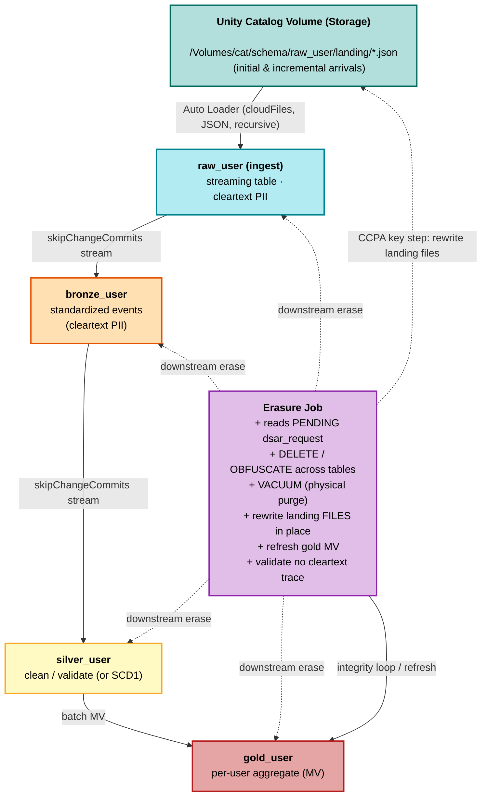

# DSAR erasure × Lakeflow Declarative Pipelines (SDP) — with Auto Loader

Integrates per-subject DSAR/CCPA erasure with a **streaming** Lakeflow Declarative
Pipeline that ingests raw files via **Auto Loader**, so an erasure removes/masks a
subject's records at **every layer (raw → bronze → silver → gold)** **and in the
source files** — **without stopping the pipeline, without a full refresh, and in a way
that survives a full refresh**.

Self-contained sub-solution of the [`dsar_erasure/`](../) layer. Uses the **modern**
Lakeflow Declarative Pipelines Python API: `from pyspark import pipelines as dp`
(`@dp.table`, `@dp.materialized_view`, `dp.create_auto_cdc_flow`). *(Not the legacy
`import dlt` module.)*

## End-to-end architecture & data flow

Rendered inline (GitHub gives zoom/pan controls). A static copy —
[`architecture.png`](architecture.png) — and the source [`architecture.mmd`](architecture.mmd)
are kept in sync; re-render with `mmdc -i architecture.mmd -o architecture.png -b white -s 2`.

> **Erasure removes the subject from the tables AND the source files.** `DELETE`/`VACUUM`
> permanently purges the base tables; the landing files are rewritten in place (drop
> records for DELETE, redact for OBFUSCATE) so a **full refresh cannot resurrect** an
> erased subject. Gold is a materialized view — it can't be `DELETE`d, so `02` refreshes
> it to recompute clean from silver.

**Erasure touches both the tables and the files.** Because Auto Loader ingests from
files, erasing only the tables would leave cleartext PII in the volume — and a **full
refresh re-reads those files**, resurrecting the subject. `02` therefore rewrites the
affected landing files in place (drop records for DELETE, redact for OBFUSCATE). Verified
live: after erasure + full refresh, deleted subjects stay gone.

## The problem it solves

Allegiant's Merlot ingest is an SDP: `autoloader → obfuscation view → bronze STREAMING
TABLE → silver (AUTO CDC/SCD1) → gold`. An in-place DSAR erasure `UPDATE`/`DELETE` on
the append-only bronze streaming source is a **non-append commit** → the downstream
flow fails fatally:

> *Streaming tables may only use append-only streaming sources... we detected an update
> or delete to one or more rows in the source table.*

## The fix

`.option("skipChangeCommits", "true")` on **every streaming read** that consumes a
table an erasure mutates. The stream **skips** the erasure's non-append commit instead
of failing — the row is still gone; the stream just doesn't crash. Skipping a commit
only advances the offset (no data read) → negligible latency.

- **`raw_user`** — Auto Loader (`cloudFiles`, JSON) ingest of the volume landing files;
  holds cleartext PII + stable non-PII `user_id`.
- **`bronze_user`** — streaming; standardizes events. **Cleartext PII flows through**
  (no mask-at-ingest in this DSAR demo — every layer holds real PII until an erasure
  targets a subject). `skipChangeCommits` on the read of `raw_user`.
- **`silver_user`** — streaming; cleaned/validated events (or SCD1 dimension in the CDC
  variant). Reads **bronze**; `skipChangeCommits` on that read.
- **`gold_user`** — **materialized view**; per-customer rollup over **silver**. Batch
  recompute → reflects erasures on refresh, no checkpoint state to resurrect a subject.
  You cannot `DELETE` from a view, so `02` erases the base tables + refreshes the MV.

### Why `user_id` is the match key

Intake gives an **email**; `02` resolves email → stable **`user_id`** once (from
`raw_user`) and erases by `user_id` at every layer. `user_id` is a non-PII business
key, so it still identifies the subject **after** an OBFUSCATE has redacted their
email/name — matching on email alone would fail on already-redacted rows.

## Files

| File | What | How to run |
|------|------|-----------|
| `00_setup_and_landing.ipynb` | Schema + **UC volume** + **initial landing JSON files** + 1st `dsar_request` wave | **Batch** — run once per cycle |
| `00b_incremental_landing.ipynb` | **Append new landing files** + enqueue a **2nd DSAR wave** (new + old subjects) | **Batch** — per incremental round |
| `01_sdp_pipeline.ipynb` | Pipeline: Auto Loader raw → bronze → silver (append) → gold MV | **Attach as a Lakeflow pipeline source** |
| `01b_sdp_pipeline_cdc_variant.ipynb` | Alt pipeline: silver as **SCD1 via AUTO CDC** (matches real Merlot) | Attach as a *separate* pipeline (own schema) |
| `02_erasure.ipynb` | Erase every PENDING subject at every layer **+ scrub volume files** + purge + refresh gold | **Batch** — run per DSAR wave |
| `03_validate.ipynb` | **Click-to-run** read-only validation (widget-driven; one `%sql` check per cell): landing files, medallion counts, masking, DSAR queue, no-trace | **Batch** — run any time |
| `sample_data/incremental_batch_1/` | Pre-made incremental landing files (upload for Part B) | Upload to the volume |
| `usage.md` | Step-by-step runbook: Part A (initial) + Part B (incremental), each step with expected outcomes | — |

## Two variants of silver

- **Append silver (`01`)** — `silver_user` is a plain streaming table of
  cleaned/validated **events** (one row per event; full history). **Not an SCD
  dimension.** Directly `DELETE`-able.
- **SCD1 silver (`01b`)** — `silver_user` is a **type-1** dimension via
  `dp.create_auto_cdc_flow` keyed on `user_id` (one row per customer, latest wins).
  Matches Allegiant's real `dbo_user_silver_cdc`. Separate pipeline, own schema
  (`allegiant_air_sdp_dsar_cdc`).

*(Neither is SCD type 2.)*

## Two run cycles

- **Initial (Part A):** `00` (files + queue) → pipeline initial load → `02` (wave 1) →
  optional full-refresh proof.
- **Incremental (Part B):** `00b` (new files + wave 2 mixing new & old subjects) →
  pipeline **incremental** run → `02` (wave 2). Repeatable.

## Two erasure modes (per `dsar_request` row)

- **DELETE** — remove the subject's rows entirely (tables) and drop their records
  (files).
- **OBFUSCATE** — keep rows, redact PII cells + in-JSON PII to `***REDACTED***`
  (tables and files).

## Idempotency & full-refresh safety

Erasure removes subjects from the base tables **and the source files**, so the pipeline
is idempotent under any mix of incremental and full-refresh updates: a full refresh
re-reads the (scrubbed) files, so erased subjects never reappear.

## Alignment with Databricks' GDPR/CCPA guidance

This solution follows Databricks' official
[Process GDPR and CCPA deletion requests with Lakeflow Declarative Pipelines](https://docs.databricks.com/aws/en/ldp/gdpr)
guidance, point for point:

| Databricks guidance | How `02_erasure` implements it |
|---|---|
| Delete from the **source** Delta tables via DML | DELETE → `DELETE` on `raw_user`; OBFUSCATE → `UPDATE` (redact PII) on `raw_user` |
| Delete from the **streaming tables** via DML | Every layer carries cleartext PII in this demo, so both modes act on **all** base tables: DELETE removes rows from `bronze_user`+`silver_user`; OBFUSCATE redacts them there too (symmetric with raw) |
| Streaming reads must use **`skipChangeCommits`** so the delete doesn't fail the flow | Set on both streaming hops (raw→bronze, bronze→silver) — hardened from the start |
| **Materialized views** auto-handle deletes — just **refresh** | `gold_user` is an MV; `02` **refreshes** it (never `DELETE`s a view). It **auto-discovers** the owning pipeline from `gold_user`'s `pipelines.pipelineId` table property and triggers the refresh itself (falls back to the `pipeline_id` widget / manual command) |
| Physically remove records: **`REORG TABLE … APPLY (PURGE)`** (deletion vectors) | `purge()` runs `REORG … APPLY (PURGE)` on each modified table |
| **`VACUUM`** to permanently remove old file versions (history retention) | `VACUUM` after `delta.deletedFileRetentionDuration='interval 0 hours'` (serverless-safe) |
| ⚠️ *"you must also remember to delete data in **upstream sources, such as queues and cloud storage**"* | **`02` scrubs the Auto Loader landing files in the UC volume** (rewrite in place: drop for DELETE, redact for OBFUSCATE) — the doc raises this requirement but provides no mechanism; this is the file-scrub step, proven by the full-refresh acid test |

> **Beyond the doc:** the guidance explicitly calls out cloud-storage/upstream deletion
> as a requirement but leaves it to the reader. Because our source of truth is *files*
> ingested by Auto Loader, we implement it directly — so a **full refresh cannot
> resurrect** an erased subject (verified live). Without the file scrub, a full refresh
> re-reads the original files and re-materializes the subject — a GDPR/CCPA violation.

### Relationship to the *GDPR discovery & deletion using data classification* notebook

Databricks also ships a
[GDPR discovery & deletion notebook](https://docs.databricks.com/aws/en/data-governance/unity-catalog/data-classification)
that **discovers** PII tables from `system.data_classification.results` (auto-classification
tags, e.g. `class.email_address`) and runs a plain `DELETE … WHERE email = …` on each.
That notebook is a great **discovery front-end** but targets **static Delta tables** — a
bare `DELETE` on a *streaming* Declarative-Pipeline source **fails** (`append-only
source`, the exact incident this solution fixes) and it does not address materialized
views, physical purge, or source files. This solution is the **pipeline-grade** erasure
engine; the two are complementary — you could use classification to *discover* which
tables/columns hold PII, then feed subjects into this pipeline's `dsar_request` queue to
*erase* them safely across a live streaming medallion. *(Note: `system.data_classification.results`
requires the data-classification feature enabled + elevated privileges; this solution
does not depend on it.)*

## Status

**Verified end-to-end live** (2026-07-28, `e2-demo-field-eng`, serverless, schema
`dkushari_uc.allegiant_air_sdp_dsar`, volume `raw_user`):
- `00` wrote 8 JSON files (10k records) to the volume + seeded **10 PENDING requests**
  (`num_requests`, configurable; alternating DELETE/OBFUSCATE, REQ-001…010).
- `01` Auto Loader pipeline COMPLETED: **cleartext** flows raw → bronze → silver (10k) →
  gold (2k) — no mask-at-ingest in this model.
- `02` (wave 1) processed all 10 requests: **5 DELETE** removed from every layer **and
  the volume files** (raw 10k → 9,975), **5 OBFUSCATE** redacted at every layer + files
  (rows kept as `***REDACTED***`); physical purge ran (`REORG` + `VACUUM`); **gold
  auto-refreshed** (2000 → 1,995 via the discovered `pipelines.pipelineId`); all COMPLETE.
- **Full refresh after erasure: deleted subjects did NOT return** (raw stayed 9,975) —
  the CCPA acid test for file-level erasure.
- Part B: `00b` landed 24 new records (`U9000xx`) + a mixed wave-2 (2 new + 2 old,
  REQ-011…014); **incremental** pipeline run ingested only the new 24; `02` (wave 2)
  erased new + old subjects across tables and files; all requests COMPLETE.
- Purge verified on the pipeline-managed tables: retention set in the pipeline
  (`table_properties`), `REORG APPLY(PURGE)` + `VACUUM RETAIN 0 HOURS` from `02` (history
  shows `REORG`/`VACUUM START`/`VACUUM END`; no `INVALID_TARGET` error).

## Requirements

Serverless Lakeflow Declarative Pipelines (AUTO CDC needs it). Unity Catalog with a
volume. All names widget/config-driven.

See `usage.md` for the full runbook.
