# DSAR erasure × Lakeflow Declarative Pipelines (SDP) — with Auto Loader

Integrates per-subject DSAR/CCPA erasure with a **streaming** Lakeflow Declarative
Pipeline that ingests raw files via **Auto Loader**, so an erasure removes/masks a
subject's records at **every layer (raw → bronze → silver → gold)** **and in the
source files** — **without stopping the pipeline, without a full refresh, and in a way
that survives a full refresh**.

Self-contained sub-solution of the [`dsar_erasure/`](../) layer. Uses the **modern**
Lakeflow Declarative Pipelines Python API: `from pyspark import pipelines as dp`
(`@dp.table`, `@dp.materialized_view`, `dp.create_auto_cdc_flow`). *(Not the legacy
`import dlt` module.)*

## End-to-end architecture & data flow

```mermaid
flowchart LR
    %% Define color classes for the legend
    classDef storage fill:#e0f2f1,stroke:#00695c,stroke-width:2px,color:#000
    classDef raw fill:#e0f7fa,stroke:#00838f,stroke-width:2px,color:#000
    classDef bronze fill:#ffe0b2,stroke:#e65100,stroke-width:2px,color:#000
    classDef silver fill:#fff9c4,stroke:#fbc02d,stroke-width:2px,color:#000
    classDef gold fill:#ffcdd2,stroke:#b71c1c,stroke-width:2px,color:#000
    classDef erasure fill:#e1bee7,stroke:#4a148c,stroke-width:2px,color:#000

    %% Node Definitions
    UCV["Unity Catalog Volume (Storage)<br/>/Volumes/cat/schema/raw_user/landing/*.json<br/>(initial & incremental arrivals)"]:::storage

    RawIngest["raw_user (ingest)"]:::raw
    RawPII["raw_user PII<br/>cleartext"]:::raw

    Bronze["bronze_user<br/>mask PII<br/>scalar + in-JSON"]:::bronze
    Silver["silver_user<br/>clean / validate<br/>(or SCD1)"]:::silver
    Gold["gold_user<br/>per-user aggregate (MV)"]:::gold

    Erasure["Erasure Job<br/>+ reads PENDING dsar_request<br/>+ DELETE / OBFUSCATE across tables<br/>+ VACUUM (physical purge)<br/>+ rewrite landing FILES in place<br/>+ refresh gold MV<br/>+ validate no cleartext trace"]:::erasure

    %% Data Ingestion Flow
    UCV -->|Auto Loader <br/> cloudFiles, JSON, recursive| RawIngest
    UCV -->|skipChangeCommits stream| RawPII
    RawIngest --> RawPII

    %% Processing Pipeline
    RawPII -->|skipChangeCommits stream| Bronze
    Bronze -->|skipChangeCommits stream| Silver
    Silver -->|batch MV| Gold

    %% Erasure Flow & Integrity Loop
    Erasure -.->|CCPA key step: rewrite landing files| UCV
    Erasure -.->|downstream erase| RawPII
    Erasure -.->|downstream erase| Bronze
    Erasure -.->|downstream erase| Silver
    Erasure -.->|downstream erase| Gold
    Erasure -->|integrity loop / refresh| Gold
```

> **Erasure removes the subject from the tables AND the source files.** `DELETE`/`VACUUM`
> permanently purges the base tables; the landing files are rewritten in place (drop
> records for DELETE, redact for OBFUSCATE) so a **full refresh cannot resurrect** an
> erased subject. Gold is a materialized view — it can't be `DELETE`d, so `02` refreshes
> it to recompute clean from silver.

**Erasure touches both the tables and the files.** Because Auto Loader ingests from
files, erasing only the tables would leave cleartext PII in the volume — and a **full
refresh re-reads those files**, resurrecting the subject. `02` therefore rewrites the
affected landing files in place (drop records for DELETE, redact for OBFUSCATE). Verified
live: after erasure + full refresh, deleted subjects stay gone.

## The problem it solves

Allegiant's Merlot ingest is an SDP: `autoloader → obfuscation view → bronze STREAMING
TABLE → silver (AUTO CDC/SCD1) → gold`. An in-place DSAR erasure `UPDATE`/`DELETE` on
the append-only bronze streaming source is a **non-append commit** → the downstream
flow fails fatally:

> *Streaming tables may only use append-only streaming sources... we detected an update
> or delete to one or more rows in the source table.*

## The fix

`.option("skipChangeCommits", "true")` on **every streaming read** that consumes a
table an erasure mutates. The stream **skips** the erasure's non-append commit instead
of failing — the row is still gone; the stream just doesn't crash. Skipping a commit
only advances the offset (no data read) → negligible latency.

- **`raw_user`** — Auto Loader (`cloudFiles`, JSON) ingest of the volume landing files;
  holds cleartext PII + stable non-PII `user_id`.
- **`bronze_user`** — streaming; masks PII inline (scalar + in-JSON), preserves
  `user_id`/`revenue`. `skipChangeCommits` on the read of `raw_user`.
- **`silver_user`** — streaming; cleaned/validated events (or SCD1 dimension in the CDC
  variant). Reads **bronze**; `skipChangeCommits` on that read.
- **`gold_user`** — **materialized view**; per-customer rollup over **silver**. Batch
  recompute → reflects erasures on refresh, no checkpoint state to resurrect a subject.
  You cannot `DELETE` from a view, so `02` erases the base tables + refreshes the MV.

### Why `user_id` is the match key

Intake gives an **email**, but bronze/silver mask it — so `02` resolves email →
`user_id` once from the raw layer, then erases by `user_id` everywhere. `user_id` is
non-PII and survives masking.

## Files

| File | What | How to run |
|------|------|-----------|
| `00_setup_and_landing.ipynb` | Schema + **UC volume** + **initial landing JSON files** + 1st `dsar_request` wave | **Batch** — run once per cycle |
| `00b_incremental_landing.ipynb` | **Append new landing files** + enqueue a **2nd DSAR wave** (new + old subjects) | **Batch** — per incremental round |
| `01_sdp_pipeline.ipynb` | Pipeline: Auto Loader raw → bronze → silver (append) → gold MV | **Attach as a Lakeflow pipeline source** |
| `01b_sdp_pipeline_cdc_variant.ipynb` | Alt pipeline: silver as **SCD1 via AUTO CDC** (matches real Merlot) | Attach as a *separate* pipeline (own schema) |
| `02_erasure.ipynb` | Erase every PENDING subject at every layer **+ scrub volume files** + purge + refresh gold | **Batch** — run per DSAR wave |
| `sample_data/incremental_batch_1/` | Pre-made incremental landing files (upload for Part B) | Upload to the volume |
| `usage.md` | Step-by-step runbook: Part A (initial) + Part B (incremental), each step with expected outcomes | — |

## Two variants of silver

- **Append silver (`01`)** — `silver_user` is a plain streaming table of
  cleaned/validated **events** (one row per event; full history). **Not an SCD
  dimension.** Directly `DELETE`-able.
- **SCD1 silver (`01b`)** — `silver_user` is a **type-1** dimension via
  `dp.create_auto_cdc_flow` keyed on `user_id` (one row per customer, latest wins).
  Matches Allegiant's real `dbo_user_silver_cdc`. Separate pipeline, own schema
  (`allegiant_air_sdp_dsar_cdc`).

*(Neither is SCD type 2.)*

## Two run cycles

- **Initial (Part A):** `00` (files + queue) → pipeline initial load → `02` (wave 1) →
  optional full-refresh proof.
- **Incremental (Part B):** `00b` (new files + wave 2 mixing new & old subjects) →
  pipeline **incremental** run → `02` (wave 2). Repeatable.

## Two erasure modes (per `dsar_request` row)

- **DELETE** — remove the subject's rows entirely (tables) and drop their records
  (files).
- **OBFUSCATE** — keep rows, redact PII cells + in-JSON PII to `***REDACTED***`
  (tables and files).

## Idempotency & full-refresh safety

Erasure removes subjects from the base tables **and the source files**, so the pipeline
is idempotent under any mix of incremental and full-refresh updates: a full refresh
re-reads the (scrubbed) files, so erased subjects never reappear.

## Status

**Verified end-to-end live** (2026-07-28, `e2-demo-field-eng`, serverless, schema
`dkushari_uc.allegiant_air_sdp_dsar`, volume `raw_user`):
- `00` wrote 8 JSON files (10k records) to the volume + seeded 3 PENDING requests.
- `01` Auto Loader pipeline COMPLETED: raw 10k → bronze/silver masked 10k → gold 2k.
- `02` (wave 1) erased 2 DELETE + 1 OBFUSCATE across tables **and volume files**
  (files dropped to 9,990; OBFUSCATE kept as redacted); marked COMPLETE.
- **Full refresh after erasure: deleted subjects did NOT return** (raw stayed 9,990) —
  the CCPA acid test for file-level erasure.
- Part B: `00b` landed 24 new records + a mixed wave-2 (2 new + 2 old); **incremental**
  pipeline run ingested only the new 24; `02` (wave 2) erased new + old subjects across
  tables and files; all 7 requests COMPLETE.

## Requirements

Serverless Lakeflow Declarative Pipelines (AUTO CDC needs it). Unity Catalog with a
volume. All names widget/config-driven.

See `usage.md` for the full runbook.
